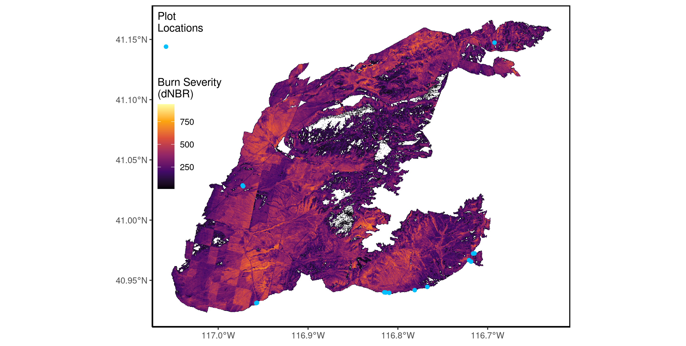

\beginsupplement

# Appendix S1 for: "Fuel connectivity, burn severity, and seedbank survivorship drive ecosystem transformation in a semi-arid shrubland." 

-Submitted to *Ecology*

Adam L. Mahood^1,2,3,`*`^, Michael J. Koontz^2^, Jennifer K. Balch^1,2,4^

\small

^1^ Department of Geography, University of Colorado Boulder, Boulder, CO, USA

^2^ Earth Lab, University of Colorado, Boulder, CO, USA

^3^ Agricultural Research Service, United States Department of Agriculture, Fort Collins, CO, USA

^4^ Environmental Data Science Innovation and Inclusion Lab, University of Colorado, Boulder, CO, USA

`*` Corresponding author: admahood@gmail.com

\normalsize

\newpage


```{r, message=F, echo=F, warning=F, results='asis'}
library(knitr)
library(dplyr)
library(kableExtra)
library(tidyverse)
options(knitr.kable.NA = '')
```


\newpage




\newpage


\newpage


\newpage


\newpage


\newpage


