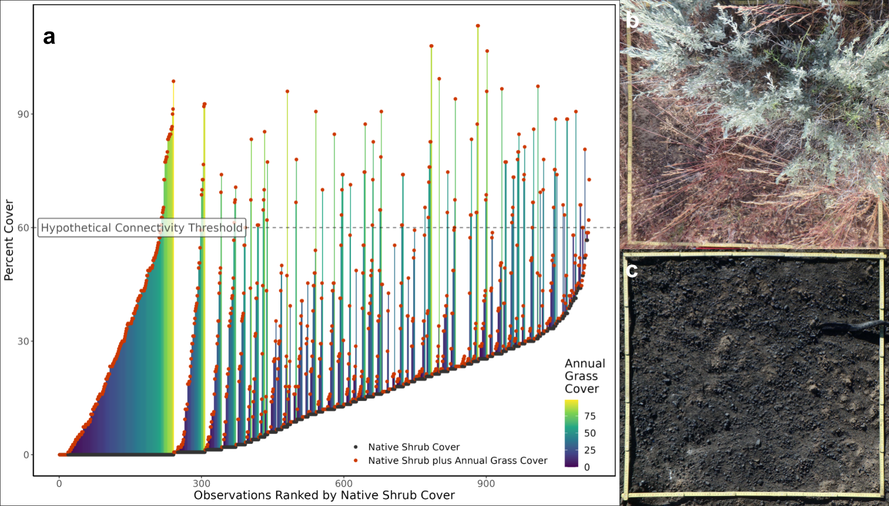
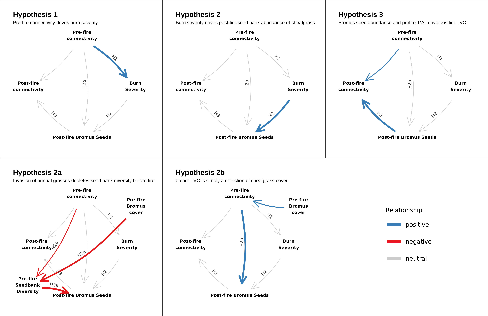

# Fuel connectivity, burn severity, and seedbank survivorship drive ecosystem transformation in a semi-arid shrubland.

This repository houses the code for our upcoming paper, "Fuel connectivity, burn severity, and seedbank survivorship drive ecosystem transformation in a semi-arid shrubland." Please feel free to message me with questions about the code or analysis.

# **Figure S1.** Map of the study area

Different patterns of land use and land cover are evident in the patterns of burn severity. Particularily of note is the visibility of the checkerboard pattern of public/private land ownership that occurs around the I-80 interstate.

# **Figure 2.** The importance of structure over taxonomic identity

Sites with little to no shrub cover require high IAG cover to meet the threshold necessary to carry a fire, while sites with higher shrub cover may reach that threshold with much lower IAG cover. Therefore, annual grass cover alone may not be sufficient for quantifying fire risk. Panel a illustrates this point using publicly available data from the Bureau of Land Management's Assessment, Inventory and Monitoring dataset. Panels b and c show quadrats at a site with high, pre-fire native perennial cover weeks before and days after the Hot Pot fire, which burned at high severity at that site. 

# **Figure 3.** Conceptual diagram of the hypotheses tested in this study.

# **Figure 4.** Main Results

Panel a is a path model showing support for the various hypotheses depicted in Figure 3. Red arrows are negative relationships, blue arrows are positive relationships, and grey arrows are not significant (p > 0.05) but still accounted for in the model. Abbreviations: pre = pre-fire; post = post-fire; cv = cover; elv = elevation; ag = aboveground; sb = seed bank; sev = severity; div = diversity. On the left side of (b), burn severity (dNBR) as predicted by total vegetation cover (TVC; the sum of live and dead, shrub and herbaceous cover). On the right, burn severity is predicted by modelled TVC. In (c), fuel connectivity three years post-fire is modelled by seedbank composition, elevation and pre-fire aboveground species richness. In (d) Shannon-Weaver diversity index of the aboveground, post-fire community composition, was negatively affected by fuel connectivity after accounting for elevation. For a, c and d, lines are the fitted partial effects, points are the partial residuals, and dotted lines are the 95% confidence intervals. p < 0.05 for black lines, p > 0.05 for grey lines. Panel e shows the modeled occurrence of germinable seeds for all species found at more than one location along a gradient of burn severity, after accounting for soil depth, aspect, elevation and pre-fire diversity. Black line is the mean prediction, each colored line represents one posterior sample.

