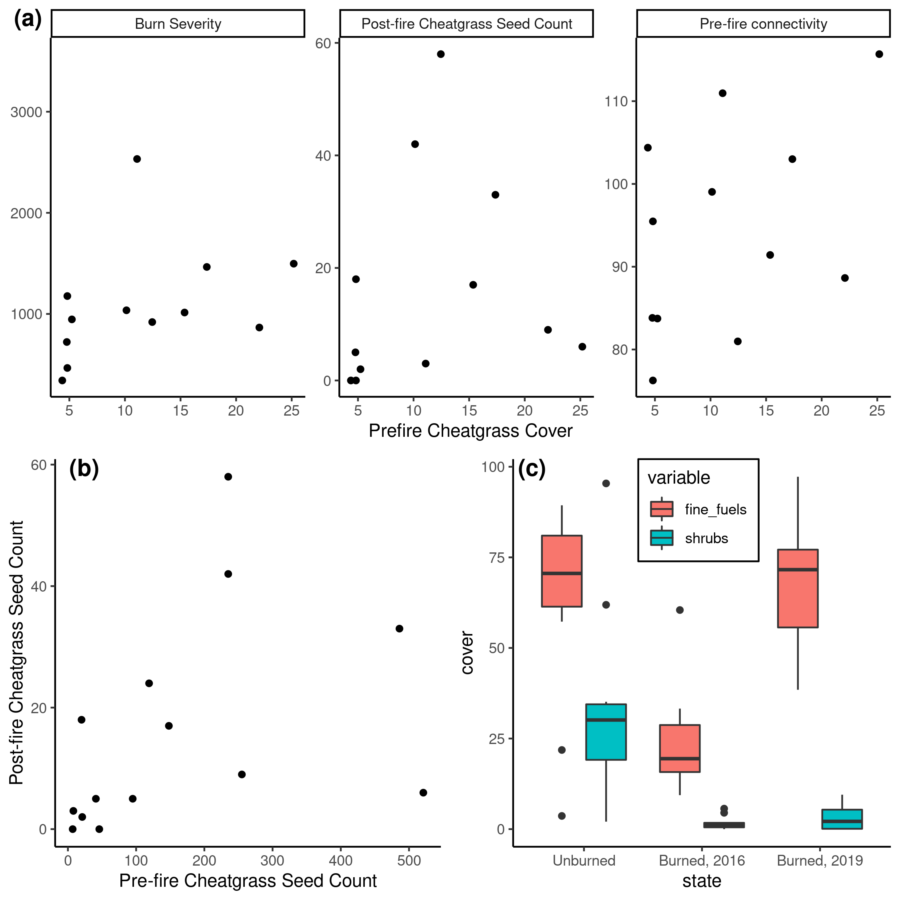

# Fuel connectivity, burn severity, and seedbank survivorship drive ecosystem transformation in a semi-arid shrubland.

This repository houses the code for our upcoming paper, "Fuel connectivity, burn severity, and seedbank survivorship drive ecosystem transformation in a semi-arid shrubland." Please feel free to message me with questions about the code or analysis.

# Abstract 

A key challenge in ecology is understanding how multiple drivers interact to precipitate persistent vegetation state changes. These state changes may be both precipitated and maintained by disturbances, but predicting whether the state change is fleeting or persistent requires an understanding of the mechanisms by which disturbance affects the alternative communities. In the sagebrush shrublands of the western United States, widespread annual grass invasion has increased fuel connectivity, which increases the size and spatial contiguity of fires, leading to post-fire monocultures of introduced annual grasses (IAG). The novel grassland state can be persistent, and more likely to promote large fires than the shrubland it replaced. But the mechanisms by which pre-fire invasion and fire occurrence are linked to higher post-fire flammability are not fully understood. A natural experiment to explore these interactions presented itself when we arrived in northern Nevada immediately after a 50,000 ha wildfire was extinguished.

We hypothesized that the novel grassland state is maintained via a reinforcing feedback where higher fuel connectivity increases burn severity, which subsequently increases post-fire IAG dispersal, seed survivorship, and fuel connectivity. We used a Bayesian joint species distribution model and structural equation model framework to assess the strength of the support for each element in this feedback pathway. We found that pre-fire fuel connectivity increased burn severity and that higher burn severity had mostly positive effects on the occurrence of IAG and another non-native species, and mostly negative or neutral relationships with all other species. Finally, we found that the abundance of IAG seeds in the seedbank immediately post-fire had a positive effect on the fuel connectivity 3 years after fire, completing a positive feedback promoting IAG. These results demonstrate that the strength of the positive feedback is controlled by measurable characteristics of ecosystem structure, composition and disturbance. Further, each node in the loop is affected independently by multiple global change drivers. It is possible that these characteristics can be modeled to predict threshold behavior and inform management actions to mitigate or slow the establishment of the grass-fire cycle, perhaps via targeted restoration applications or pre-fire fuel treatments.

# **Figure S1.** Map of the study area

Different patterns of land use and land cover are evident in the patterns of burn severity. Particularily of note is the visibility of the checkerboard pattern of public/private land ownership that occurs around the I-80 interstate.

# Figure S5. Looking only at cheatgrass doesn't explain much

We initially thought it would be pretty simple to just plot burn severity against cheatgrass cover. Turns out, we didn't find much.

Panel a illustrates how we did not find convincing evidence that pre-fire cheagrass
cover alone was predictive of any of the key components of our hypothesized feedback loop.
Panel b shows how even pre-fire cheatgrass seed counts were not predictive of post-fire
seed counts. Panel c shows the general change in structural composition, from woody to
herbaceous, before and after the fire.

# **Figure 2.** The importance of structure over taxonomic identity

Sites with little to no shrub cover require high IAG cover to meet the threshold necessary to carry a fire, while sites with higher shrub cover may reach that threshold with much lower IAG cover. Therefore, annual grass cover alone may not be sufficient for quantifying fire risk. Panel a illustrates this point using publicly available data from the Bureau of Land Management's Assessment, Inventory and Monitoring dataset. Panels b and c show quadrats at a site with high, pre-fire native perennial cover weeks before and days after the Hot Pot fire, which burned at high severity at that site. 

# **Figure 3.** Conceptual diagram of the hypotheses tested in this study.

# **Figure 4.** Main Results

Panel a is a path model showing support for the various hypotheses depicted in Figure 3. Red arrows are negative relationships, blue arrows are positive relationships, and grey arrows are not significant (p > 0.05) but still accounted for in the model. Abbreviations: pre = pre-fire; post = post-fire; cv = cover; elv = elevation; ag = aboveground; sb = seed bank; sev = severity; div = diversity. On the left side of (b), burn severity (dNBR) as predicted by total vegetation cover (TVC; the sum of live and dead, shrub and herbaceous cover). On the right, burn severity is predicted by modelled TVC. In (c), fuel connectivity three years post-fire is modelled by seedbank composition, elevation and pre-fire aboveground species richness. In (d) Shannon-Weaver diversity index of the aboveground, post-fire community composition, was negatively affected by fuel connectivity after accounting for elevation. For a, c and d, lines are the fitted partial effects, points are the partial residuals, and dotted lines are the 95% confidence intervals. p < 0.05 for black lines, p > 0.05 for grey lines. Panel e shows the modeled occurrence of germinable seeds for all species found at more than one location along a gradient of burn severity, after accounting for soil depth, aspect, elevation and pre-fire diversity. Black line is the mean prediction, each colored line represents one posterior sample.

