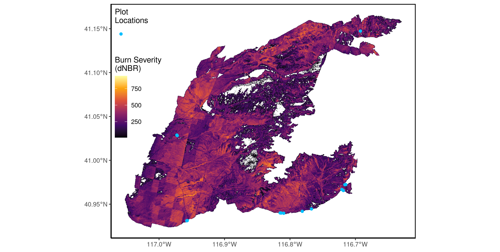
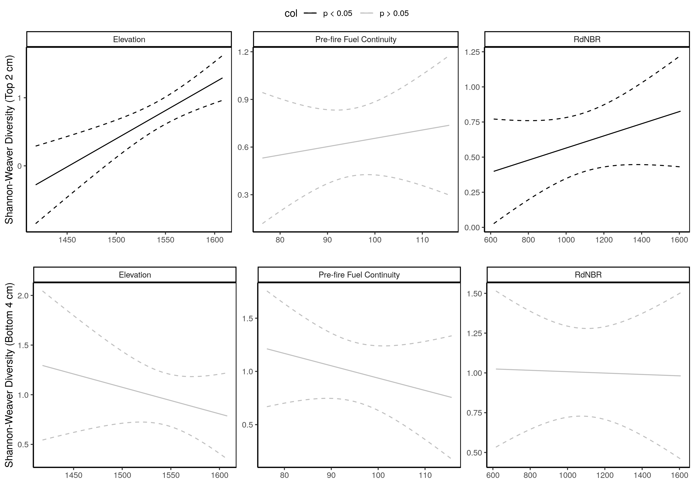

---
header-includes:
    - \usepackage{setspace}\doublespacing
    - \usepackage[left]{lineno}
bibliography: sb_refs.bib
fontsize: 12pt
geometry: margin=1in
output:
  pdf_document: default
  html_document:
    df_print: paged
  word_document: default
---

```{r setup, include=FALSE}
knitr::opts_chunk$set(echo = FALSE,cache = FALSE)
```


\pagenumbering{roman} 

\pagebreak

\pagenumbering{arabic} 

Running head: Annual grasses, burn severity, seedbank

Title: High fuel connectivity from annual grass invasion increases burn severity, which alters seedbank composition to favor annual grass invasion.

Adam L. Mahood^1,2,`*`^, Michael J. Koontz^2^, Jennifer K. Balch^1,2^

\small

^1^ Department of Geography, University of Colorado Boulder, Boulder, CO, USA

^2^ Earth Lab, University of Colorado, Boulder, CO, USA

`*` Corresponding author: admahood@gmail.com

\normalsize


\newpage

\linenumbers

## Abstract 

<!-- (200-300 words) -->

Alternative stable states are an important topic in the context of global change in which positive feedbacks maintain two distinct plant communities under the same climatic conditions. In sagebrush communities in the western United States, annual grass invasion increases the connectivity of fine fuels, which increases the size and spatial contiguity of fires. This results in post-fire systems that are dominated by introduced annual grasses. But it is unclear exactly how fire directly benefits the introduced annual grasses. Here, we used total vegetation cover (TVC) as a proxy for fuel connectivity and found that pre-fire TVC increased burn severity. We then used a joint species distribution model to examine how burn severity affected the proportion of introduced annual plants in the seed bank, and found that higher burn severity had mostly positive or neutral effects on the occurrence of non-native species, and mostly negative or neutral relationships with native species. We then tested if post-fire seed bank composition affected post-fire TVC, we found that the abundance of annual grass seeds in the seedbank immediately post-fire had a positive effect on the fuel connectivity 3 years later. This is the first study that we are aware of in the western US that shows how burn severity influences seed bank species composition, as well as examining the full feedback loop with fuel connectivity.

## 1. Introduction

One of the consequences of global change in the 21$^\text{st}$ century that is most difficult to reverse is when ecosystems abruptly shift from one stable species assemblage to another [@Ratajczak2018]. In tropical ecosystems, three alternative stable states have been identified along a gradient of precipitation: forests, savannas and grasslands [@Hirota2011; @Staver2011]. These three states cluster around values of tree cover (approximately 80, 30 and 0 percent) that occur among overlapping levels of precipitation, and so it is thought that they exhibit states of hysteresis in which internal, self-reinforcing mechanisms maintain alternate states [@Andersen2009]. In the forested state there is a self-reinforcing positive feedback between evapotranspiration and tree cover [@Staal2020]. In the grassland and savanna states, there are feedbacks between grass flammability and fire occurrence [@Staver2011; @DAntonio1992]. 

A classic example of hysteresis in a semi-arid, temperate system is the invasion of *Bromus tectorum* L. and other introduced annual grasses in the Great Basin of the western United States. Here, over half of Wyoming big sagebrush (*Artemisia tridentata* ssp. *wyomingensis* Beetle & Young) ecosystems have been degraded, fragmented or lost completely [@Davies2011]. This has been attributed to a host of causes, including wildfire [@Balch2013], grazing [@Williamson2019], land use/land cover change, and the invasion of annual grasses. In this open shrubland, the space between shrubs is primarily composed of bare ground covered in biological soil crust, dotted with perennial bunch grasses. The lack of fuel connectivity is believed to have limited fire spread, with a fire regime of infrequent, patchy fires [@Keeley2019]. Annual grass invasion increases fuel connectivity while decreasing fuel moisture [@Davies2013], leading to increased fire size and frequency [@Whisenant1990; @Knapp1996; @Balch2013]. After fire, the landscape is often dominated by introduced annual grasses and forbs. This causes a >50% loss of aboveground carbon storage [@Bradley2006; @Nagy2020]. But in order to understand how the grassland state persists, the mechanisms by which fire benefits the introduced annual grass must be understood. @Petraitis1999 posited that the maintenance of alternate species assemblages requires first a disturbance that removes the species from the initial assemblage and second the arrival of the species of the alternate assemblage. One understudied mechanism that may explain both is the interaction between burn severity and the species composition of the soil seed bank.

Studies that directly examine the relationship between the species composition of the seed bank and fire severity and/or intensity are uncommon, but more attention has been given to the subject recently. In boreal forests, the depth of the burn may be more important more than the temperature of the fire, with species-specific effects on recovery depending on whether the species recovers via resprouting or from the seed bank [@Morgan1988; @Schimmel1996]. In a wetland study in Japan, high severity fire was found to increase seedbank diversity, and the similarity between the seedbank composition and aboveground composition was higher in places burned at high severity [@Kimura2011]. There have been a handful of studies in temperate, semi-arid regions. @Lipoma2018 found that in shrubland high-severity fire reduced the overall number of seeds in the seedbank but did not change the floristic or functional composition. @Maia2012 found intraspecific differences in post-fire seedbank densities that were explained by burn severity in a pine plantation in Portugal. @Palmer2018 found that the residual seedbank after fire varied with severity between two *Acacia* species in Australia. @Wright2016 found that Australian mulga (*Acacia aneura*) had higher regeneration after higher fire temperatures. In Iran, @Heydari2017 found that low-severity fire increased diversity in the soil seed bank, but high-severity fire led to losses. These studies show that the effects of fire severity on the seed bank are ecosystem- and species-specific. High severity fire can benefit species that use the seedbank [@Kimura2011], be seedbank-neutral [@Lipoma2018], or have a negative effect [@Heydari2017]. Furthermore, the effects of burn severity go beyond seed mortality. Fire temperature can alter physical seed dormancy thresholds [@Liyanage2017]. In different systems, individual species have adapted strategies to cope with fires that may be tailored to different severities.

Because *B. tectorum* is annual, in order for it to benefit from fire, which it clearly does [@Balch2013; @Mahood2019], it would have to have enough seeds in the post-fire landscape to achieve a fitness benefit and become well-represented in the post-fire plant assemblage [@Bond1995]. If the fire is patchy, this can happen through post-fire seed dispersal, and *B. tectorum* seeds have been shown to have increased dispersal distances after fire [@Monty2013]. Without unburned patches, seeds must survive the fire. There is strong evidence that *B. tectorum* builds a well-stocked pool of seeds in the soil and litter, even when it is not well represented in the above-ground plant assemblage [@Young1975; @Hassan1986; @Boudell2002]. If the increase in fuel connectivity caused by *B. tectorum* increases the severity of fire, it stands to reason that burn severity would influence the community composition of the post-fire seed bank in a way that facilitates the post-fire dominance of *B. tectorum*. To our knowledge, despite several studies on the relationship between fire and the seed bank in this system [@Young1975; @Hassan1986; @Humphrey2001; @Boudell2002; @Barga2018], no studies to date have examined this potential effect of burn severity on the seed bank.

There is strong evidence that *B. tectorum* invasion alters the physical properties of fire, including fire temperature [@Jones2015; @Brooks2004] and burn severity (the proportion of biomass burned [@Keeley2009; @Miller2009]). Direct measurements have shown low temperature [@Beckstead2011; @Germino2016], and lower fire temperatures can be inferred from the commonly observed phenomenon that *B. tectorum*-fueled fires burn fast. Fire duration is inversely related to soil heating and therefore affects the response of vegetation to fire [@Gagnon2015], including the capacity of the seeds of *B. tectorum* to remain viable after fire [@Humphrey2001]. Because *B. tectorum* increases horizontal fuel connectivity [@Davies2013], this leads to more contiguously burned areas with fewer unburned plants, and therefore higher burn severity---even with lower fire temperatures. The fire featured in this study is a perfect example. It burned about 50,000 hectares in less than a week. 

If increased burn severity is a mechanism by which *B. tectorum* excludes native plants in sagebrush shrublands, then an area with high burn severity may have a lower occurrence of viable seeds of native species, and a higher occurrence of the seeds of fire-tolerant introduced annual plants. This would lead to the dominance of introduced annual grasses and forbs would result in higher fuel connectivity, closing the positive feedback loop. Prior work has demonstrated that *A. tridentata* communities have historically had long fire rotations (>150 years) [@Baker2006; @Bukowski2013]. Plants that are adapted to infrequent fire would be unlikely to produce seeds that are adapted to surviving fire, or dispersal mechanisms to take advantage of the resources available immediately after fire [@Davis2000; @Keeley2011]. *A. tridentata* relies on successfully tolerating drought and opportunistically devoting its resources to producing big seed crops in wet years [@Meyer1994; @Perryman2001]. When it burns it burns with high intensity, individual plants do not survive or resprout vegetatively, and the remaining unburned neighbors seed the area [*sensu* @Schwilk2002]. The seeds have a short dispersal distance, the vast majority falling within a few meters of the parent plant [@Meyer1994; @Schlaepfer2014]. They typically lose their viability after one growing season if they remain on the soil surface or under litter, but can retain some viability for at least 24 months if they are buried under a few inches of soil [@Wijayratne2009]. 

<!-- In addition, they do have a physical dormancy mechanism [@Schlaepfer2014] so it is possible that this could interact with fire.  -->
<!-- @Barga2018 found that fire history and shrub cover best predicted below-ground composition, so areas with higher shrub cover were more likely to have potential to return to the pre-fire shrub assemblage.  -->

The Great Basin has not escaped the recent warming and drying trend that the western U.S. has experienced [@Bradford2020]. This is expected to affect *A. tridentata* directly by decreasing germination and seedling survival, and indirectly by causing the plants to produce lighter seeds [@Schlaepfer2014]. With this in mind, there is another potential self-reinforcing mechanism that could serve to maintain the high fuel connectivity state without fire. That is that the post-fire state with high fuel connectivity is associated with two mechanisms for competitive exclusion of natives. First, it reduces soil moisture which is unfavorable for *Artemisia* seedlings [@Turnbull2012; @Wilcox2012], and second the dominant plant, *B. tectorum*, can out-compete native plants for early spring moisture [@Meyer1994; @Chambers2007].

<!-- @Rice2001 used aged (4 year-old) and freshly pro- duced seed from meadow steppe and sagebrush steppe populations of an annual grass (Bromus tectorum)toin- vestigate the importance of seed age on seedling vigor and competitive ability -- physiological costs associated with seed age may affect aboveground competitive interactions and, in turn, the relative fitness of older cohorts in the soil seed bank ----- an argument for the need for repeated fires?-->

<!-- Miller, R. G., Tangney, R., Enright, N. J., Fontaine, J. B., Merritt, D. J., Ooi, M. K. J., … Miller, B. P. (2019). Mechanisms of Fire Seasonality Effects on Plant Populations. Trends in Ecology and Evolution, 34(12), 1104–1117. https://doi.org/10.1016/j.tree.2019.07.009 -->

Here, we collected soil cores from 14 locations along the perimeter of a large fire (the Hot Pot fire, ~50,000 ha) immediately after it was extinguished, in northern Nevada in July 2016. Because it burned a large area in only three days, we could sample a broad area while being reasonably certain that the climatic conditions during the fire were the same at all sites. Because we collected our samples immediately after the fire was extinguished, we felt confident that the seed bank samples did not contain seeds deposited by post-fire dispersal. We put the samples in cold storage and germinated the seeds from those cores in a greenhouse the following spring. In spring 2017 and fall 2019 we collected information on vegetation structure and diversity at each location. We hypothesized that (H1) Pre-fire fuel connectivity would be positively related to burn severity; (H2) burn severity would increase the occurrence probability of introduced annual species in the seed bank and reduce the occurrence probability of native species; (H2a) increased fuel connectivity brought on by the invasion of annual grasses already depleted the diversity of the soil seed bank before the fire occurred; (H3) the abundance of post-fire *B. tectorum* seeds would be positively related to post-fire fuel connectivity. In addition, because in our study system sites with high fuel connectivity are often near monocultures of *B. tectorum*, we hypothesized that (H4) high post-fire fuel connectivity of those near-monocultures would result in lower aboveground species diversity due to competitive pressure.

## 2. Methods

<!-- -- idea: also incorporate 1st year germinant data collected in 2016 to supplement the argument that the year was good for germinating seedlings... -- done -->
<!-- ... sagebrush seedlings need to a) exist, b) successfully germinate, c) survive the hot/dry summer to be recruited into the population -->
<!-- -- need to account for spatial autocorrellation -->

*2.1 Study Area*

The study was conducted in north-central Nevada the day after a large fire (the Hot Pot Fire) was extinguished (Figure 1). The Hot Pot Fire burned just over 50,000 hectares in less than a week. The pre-fire landcover was predominantly *B. tectorum* and Wyoming big sagebrush plant communities. The fire occurred after the early season plants, including *B. tectorum* and *Poa secunda* J. Presl, the most abundant native understory species, had gone to seed, and before the late season species, including Wyoming big sagebrush, had produced flowers. Thus we were able to isolate the effect of the fire without any confounding effects of post-fire seed dispersal, while achieving a broad spatial extent. The sites we sampled ranged from 1397 to 1607 meters in elevation. 


<!-- description of typical veg community composition etc -->
<!-- description of the fire regime  [@Baker2006; @Bukowski2013]-->
<!-- (EXTRACT average precipitation numbers, yearly precip for 2016, soil type) -->



*2.2 Seed Bank Sampling* 

<!-- figure out the burned year for the burned plots -->

In early July 2016, we collected samples of the soil seed bank at fourteen locations immediately after the Hot Pot fire was contained. Each site was located at the perimeter of the fire where it was clearly delineated by a bulldozer line or in one case a narrow dirt road. Eleven sites were mature sagebrush communities with no history of fire since at least 1984. Three plots had previously burned in 1984 according to the Monitoring Trends in Burn Severity (MTBS) fire history [@Eidenshink2007] and had high cover of *B. tectorum*, but still had scattered sagebrush cover. We used a metal stake to mark paired burned and unburned sampling locations on each side of the perimeter, 10 m from the nearest evidence of anthropogenic disturbance (i.e. bulldozer effects, footprints) associated with active fire suppression along the perimeter. Within 3 m of each marker, we extracted 12, 6 cm deep, 5 cm diameter, soil cores. Seeds of sagebrush generally do not fall far (<30 m) from their parent plants in this system [@Shinneman2016], and so they are not uniformly distributed [@Boudell2002]. In addition, seeds from *B. tectorum* [@Young1975] and *Artemisia* have different germination rates based on the micro-site they find themselves in [i.e. under a shrub or in the bare ground between shrubs, @Eckert1986]. To account for these potentially confounding effects, we placed half of the core locations under shrubs, and half in shrub interspaces. In the burned areas, it was obvious where shrubs had been located. Even when they were completely incinerated, their imprint remained on the soil surface [@Bechtold2007; @Germino2018]. To examine the effect of seed depth, we divided each soil core into 0-2 cm and 2-6 cm depths. Litter was aggregated with the 0-2 cm samples. Samples were then placed in cold storage (~2 deg C) for 3 months [@Meyer2013].

At all sites, to be sure that we were at a site where sagebrush germination could occur we checked for first year germinants (we found them at all sites), and to ensure that there were no confounding effects of post-fire seed dispersal, we determined whether or not the sagebrush were flowering (they were not flowering at all sites), and recorded species occupancy for all plant species. 

*2.3 Greenhouse Germination*

We followed the methodology of Ter Heert et al. [-@Heerdt1996] to germinate the seeds. Each sample was run through 0.2 mm sieve, and spread in a 3-5 mm layer over the top of 1 - 4 pots. These pots were filled 3 cm deep with potting soil, topped by a thin layer of sand. Pots were watered as needed to stay at field capacity. Every week emerging germinants were identified, counted and removed. Most of the germination occurred within 6 weeks, and after 8 weeks we ended the germination assay.  

<!-- XX need greenhouse conditions -- call Tess XX -->

*2.4 Post-Fire Vegetation Sampling*

In order to understand how the seed bank composition compares to the realized vegetative composition, we sampled the vegetative occupancy and cover in May 2017, the growing season immediately after the fire and again in September 2019. In 2017, at each location, we established 50m transects starting at the boundary of the burned and unburned sides of the perimeter, running perpendicular to the fire perimeter, and marked the transect ends with rebar. We measured the occupancy and abundance of all plant species by measuring cover of every species in 0.1 m$^2$ quadrats spaced every 5 m along each transect. We used the line intercept method to measure shrub cover and herbaceous plant cover along the transect. Both live and dead plants were included in these measurements. Total vegetation cover (TVC) was defined as the sum of herbaceous plant cover and shrub cover. In order to assess if sites had the potential for sagebrush regeneration immediately post-fire, we counted all first-year germinants within 50 cm of the transect, which we defined as any sagebrush individual less than 20 cm in height. In September 2019 we resampled the burned transects for occupancy and abundance of all plant species, as well as shrub and fine fuel cover. 

*2.5 Estimating Burn Severity with Landsat 8 OLI*

We downloaded the "fire bundle" of the Hot Pot fire from www.mtbs.gov. This included cloud-free Landsat 8 scenes collected before the Hot Pot fire, and already calculated layers of the Differenced Normalized Burn Ratio [dNBR; @Miller2009]. Because our sites were generally within 10 meters of the burn perimeter, The pixels directly intersecting the plot locations had the potential to be mixed pixels (i.e. containing burned and unburned ground). To minimize this effect, we extracted all the dNBR values within a 120 meter buffer for pixels whose centroids fell inside of the fire perimeter and calculated the mean. 

*2.6 Statistical Analysis*

Our statistical analysis centered around trying to understand each component of the positive feedback loop posited by the 4 hypotheses described above. In order to understand how pre-fire fuel connectivity influenced burn severity (H1), we used total vegetation cover (TVC) from two separate data sources as a proxy for fuel connectivity, and created separate linear models with TVC as the predictor variable and burn severity [dNBR, @Miller2009] as the response variable. With the field data we collected, we created an ordinary least squares (OLS) linear model with burn severity as the dependent variable and TVC (defined as shrub cover plus herbaceous plant cover from the unburned side of the paired plots), elevation and aspect as independent variables. We were concerned that because our data were collected at the edge of the fire, the burn severity calculated at each point may have been from only partially burned pixels. So, as a supplement, we examined the relationship using Landsat Thematic Mapper (TM) data and TVC from the Bureau of Land Management's Assessment, Inventory and Monitoring dataset [AIM, @AIM] to represent fuel connectivity. The AIM dataset contained 813 sampling locations within the Central Basin and Range ecoregion [@CEC2006] that were visited by BLM field crews between 2011 and 2015. They were mostly sampled once but there were some repeats, for 1,117 total measurements. For each of these points, we extracted the values of each Landsat band for the sampling year near peak biomass using a cloud-free scene from  May or early June. Then, we used those band values to calculate various vegetation indexes (Table S2), including the Green Normalized Differenced Vegetation Index (Green NDVI, Equation 1), and Normalized Differenced Senesced Vegetation Index (NDSVI, Equation 2). We used these indexes to create a beta regression model of TVC, starting with the largest possible model and used backwards selection following the methodology of @Zuur2009. We used this model to create a layer of predicted TVC for the study area for the pre-fire scene, and extracted both our predictions of TVC and dNBR of the fire from 1000 regularly-spaced points within the fire perimeter. Finally, to quantify the effect of TVC on burn severity, we created an OLS linear model with our modeled TVC and its second-order polynomial as predictor variables and burn severity as the response variable.

**Equation 1:** $Green~NDVI = \frac{NIR - Green}{NIR + Green}$

**Equation 2:** $NDSVI = \frac{SWIR_1 - Red}{SWIR_1 + Red}$

<!-- Possibly improve this by matching the two H1 models - elev / aspect/ 2nd order polys -->

To examine how burn severity affected the community composition of the seed bank (H2), we created a joint species distribution model (JSDM) in a Bayesian framework [@HMSC] for the occurrence of all species germinated from the seed bank that were found at more than one location. We created four Markov Chain Monte Carlo (MCMC) chains, each consisting of 150,000 iterations. We discarded the first 50,000 iterations for each chain and then recorded every 100th for a total of 1,000 posterior samples per chain, and 4,000 total. We assessed model convergence using the effective sample size and the potential scale reduction factor [@Gelman1992]. We used the model to predict the probability of occurrence of germinable seeds of a given species along a gradient of burn severity. We included burn severity, elevation, aspect, pre-fire seedbank diversity and soil depth as independent variables. 

To account for the possibility of H2a as a confounding factor, we included the Shannon-Weaver diversity index [@Shannon1949; @Hill1973] in the paired, unburned seed bank samples as one of the predictor variables in our JSDM. We also created OLS models with the unburned species richness and Shannon-Weaver diversity index predicted by prefire fuel connectivity, with the expectation that pre-fire fuel connectivity would have had a negative effect on the prefire seedbank diversity.

To examine how community composition and burn severity then affected subsequent fuel connectivity (H3), we created OLS models with fuel connectivity three years post-fire as the dependent variable, and burn severity, seed counts for *B. tectorum*, *P. secunda* and other species, elevation, aspect, depth, and alpha diversity as independent variables.

To examine how the resulting fuel connectivity was related to biodiversity (H4), we used the diversity data and connectivity data that we collected in 2019 to create a Poisson GLM with number of species encountered aboveground at each plot location as the dependent variable, as well as an OLS linear model with the Shannon-Weaver index [@Shannon1949; @Hill1973] as a dependent variable. We used fuel connectivity, elevation, and aspect as independent variables.

For all linear and generalized linear models, we used backwards selection to find the most parsimonious model. We fitting the largest possible model first, and removed variables that did not improve the model fit according to Akaike's Information Criterion (AIC), following the methodology of @Zuur2009. 

All analyses were done in R [@R]. Data and code to recreate the analysis is freely available on Figshare (link here after acceptance) and GitHub (https://www.github.com/admahood/seed_bank).

## 3. Results
 
We found support for each hypothesized component of the positive feedback loop. For H1, the most parsimonious model for our *in situ* observations had only TVC as the predictor, which had a weak positive relationship with burn severity ($\beta$ = 2.4, p = 0.083, R$^2$ = 0.27, Figure 2a). For our remotely sensed analysis, our most parsimonious model of TVC explained 34% of the variation and had Green NDVI, NDSVI and their interaction as predictors (Table 1???). Our model of dNBR using the predicted TVC within the fire perimeter as a predictor of dNBR explained 41% of the variation and the relationship between TVC and burn severity was positive and significant (p << 0.01, Figure 2a). 

The vast majority of seeds that germinated in the greenhouse were the two most common grass species, *P secunda* and *B. tectorum* (Table S1). Eight forb species were found in more than one location, and these 10 prevalent species are those that were used in our JSDM. Burned plots had an average of 34 $\pm$ 32 total seeds in the top 2 cm, and 12 $\pm$ 14 in the bottom 4 cm. Unburned plots had an average of 299 $\pm$ 170 in the top 2 cm and 59 $\pm$ 29 in the bottom 4 cm (Figure S1). For H2, the JSDM converged well (Gelman diagnostics all very close to 1 and the effective sample size centered on 4,000, Figure 3a). Elevation had the most significant effects on individual species (Figure 3b) and explained the most variance on average (36% Figure 3c). Burn severity explained 23% of the variance on average and was supported at the 95% level for 5 species (Figure 3b). For the introduced species, the predictions along a gradient of burn severity were positive for *B. tectorum*, *Sisymbrium altissimum* L. and *Lepidium perfoliatum* L., and negative for *Ceratocephala testiculata* and *Alyssum desertorum* Stapf (Figure 2b). For native species, the effect of burn severity on occurrence was positive for *A. tridentata*, neutral for *P. secunda* and negative for the remaining species (Figure 2b). Testing H2a revealed a positive relationship between pre-fire aboveground species diversity and pre-fire fuel connectivity, and so we felt it was reasonable to rule out pre-fire fuel connectivity as a confounding factor for H2.

For H3, we found that, after accounting for elevation, pre-fire aboveground richness, and the number of *P. secunda* seeds, the number of *B. tectorum* seeds in the postfire seedbank was positively associated with the fuel connectivity in 2019 ($\beta$ = 0.54, p = 0.01, Adj R$^2$ = 0.74,Figure 3c). 

For H4 the most parsimonious model (Adj R$^2$ = 0.89) had elevation, aspect, fuel connectivity and an interaction between elevation and fuel connectivity as predictors of aboveground Shannon-Weaver alpha diversity. Fuel connectivity was negatively associated with Shannon-Weaver diversity ($\beta$ = -0.28, p=0.004, Figure 3d).


![a) Hypothesis 1. On the left, burn severity (dNBR) as predicted by total vegetation cover (TVC; the sum of live and dead, shrub and herbaceous cover). On the right, burn severity is predicted by modelled TVC. Dotted lines are the 95% confidence intervals. b) Hypothesis 2. Modelled occurrence of germinable seeds for all species found at more than one location along a gradient of burn severity, after accounting for soil depth, aspect, elevation and pre-fire diversity. Black line is the mean prediction, each colored line represents one posterior sample. c) Hypothesis 3. Fuel connectivity three years post-fire as modelled by seedbank composition, elevation and pre-fire aboveground species richness. d) Hypothesis 4. Shannon-Weaver diversity index of the aboveground, post-fire community composition, was negatively affected by fuel connectivity after accounting for elevation. For a, c and d, lines are the fitted partial effects (in the case of multiple predictors), points are the partial residuals, dotted lines are the 95% confidence intervals.](images/big_plot.pdf)


<!-- For the first approach of analyzing H2, we found that burn severity was positively related to the number of germinable *B. tectorum* seeds after accounting for elevation, aspect and interactions between the variables (Table 1, figure XX). The number of germinable seeds of Sandberg bluegrass and all other species did not have an significant relationship with burn severity, as well as the presence of sagebrush seeds (Table 1, figure XX).  -->

<!-- We also found that burn severity had a negative effect on the Shannon-Weaver diversity index for the seedbank composition in the top 2 cm of the post-fire soil cores, but no effect on the bottom 4 cm, and there was no effect on species richness for either depth (FIGURE XX). -->

<!--  -->

<!-- ## 3.4. Discussion -->

<!-- lack of seedbank diversity might be highlighting the importance of colonization -->

<!-- It is possible that more Artemisia seeds were found in the *B. tectorum* plots because *B. tectorum* inhibits germination in the spring, therefore the seeds in the soil under heavy *B. tectorum* cover would have been suppressed from germinating, whereas perhaps those seeds in the mature, largely uninvaded shrublands would have had the opportunity to germinate. @Humphrey2001 also found high numbers of B. tectorum and zero Artemisia tridentata, even in unburned sites.  -->

<!-- [@Meyer1994] may have info on Sagebrush germination and seedbank duration -->

<!-- This type of study will be easier to conduct in the future, and meta analyses may be called for with prior studies now that creating burn severity maps is considerably easier than it used to be [@Parks2018] -->

## 4. Discussion

<!-- maybe get into kill thy neighbor & other theories? -->
<!-- BROTEC and SYSALT avoid drought and also use the drought to kill thy neighbor -->

<!-- add in discussion on seasonality TREE articles -->

In order to truly consider an annual grass-fire cycle to be maintained by self-reinforcing feedbacks, the mechanisms by which fire occurrence is linked to higher post-fire flammability must be understood. In this study we found evidence that interaction between burn severity and seed bank composition may explain that link. Prior work has shown that annual grass invasion increases fuel connectivity in western US sagebrush ecosystems by filling in shrub interspaces with a contiguous bed of fine fuels [@Davies2013]. This change in the spatial distribution of fine fuels has been associated with larger and more frequent fires [@Balch2013]. Here, we found higher fuel connectivity (via TVC) increases burn severity (H1, Figure 2a). Higher burn severity was associated with an increased occurrence of introduced annuals in the seedbank and a decreased occurrence of native plants (H2, Figure 2b). Higher abundance of *B. tectorum* seeds in the post-fire seedbank resulted in higher post-fire fuel connectivity (H3, Figure 2c). In addition, we found evidence that high post-fire fuel connectivity was associated with lower aboveground diversity (H4, Figure 2d). This suggests that during inter-fire intervals, there are additional mechanisms maintaining the post-fire species assemblage that is dominated by annual introduced plants.

<!-- prefire fuel connectivity is not due to annual grass invasion in the 11 unburned plots but is 100% the problem in all post-fire plots -->

<!-- fuel connectivity causing different impacts to diversity depending on functional composition, but the same impact on fire activity -->

The difference in species composition before and after fire explains an apparent contradiction in results between H2a (positive relationship between pre-fire fuel connectivity and diversity) and H4 (negative relationship between post-fire fuel connectivity and diversity). Most (11 out of 14) plot locations had mature canopies of native shrubs and with the inter-shrub space occupied mostly by native bunchgrasses and forbs, with fire history since 1984. The three plots with recent fire history burned in 1984 and were invaded by *B. tectorum*, but they still had significant cover of *A. tridentata*. <!-- Most plots were at least lightly invaded by *B. tectorum*, but in many of these communities there was not an annual grass monoculture dominating the understory. Rather, higher fuel connectivity may have been achieved by a productive, biodiverse understory that reached high TVC due to a wetter than average year.--> Even in locations with high annual grass cover between shrubs, shrubs provide ecosystem structural heterogeneity and islands of fertility [@Doescher1984; @Bechtold2007], and perennial natives that may have been established before invasion have deep roots established that allow for the avoidance of competition for water with shallow-rooted annuals [@Gibbens2001; @Ottaviani2020]. This may provide enough niche compartmentalization to allow native plants to persist. Three years after the Hot Pot fire, almost all of the plots were dominated by introduced annuals, and lacked any structural heterogeneity. Thus native plants may have been be able to persist via niche compartmentalization after the initial invasion, but fire burns away most of the seeds (Figure S1) and removes all of the structural benefits that shrub cover provides. In this clean slate post-fire environment, the altered species composition of the seedbank and superior post-fire dispersal of *B. tectorum* [@Monty2013] allows the process of interspecific competition to be dominant [@Schlaepfer2014].


<!-- , and that is why we saw fuel connectivity negatively affecting species diversity post-fire for H4. -->

*Global impacts*

The grass-fire cycle in the western US is reinforced through providing fitness benefits to the introduced annual grasses and forbs via at least 4 redundant processes: i) changing the composition of the seedbank, ii) competitive exclusion of native plants, iii) CO$_2$ enrichment which may preferentially enhance biomass (i.e. higher fuel connectivity) and seed production of annual grass species [@Nagel2004; @Smith2000], strengthening the fuel connectivity to burn severity to seed composition feedback loop, and iv) ecohydrological feedbacks that create a warmer, drier microclimate [@Turnbull2012; @Wilcox2012]. It is likely that some of these feedbacks are idiosyncratic to the system being studied, while others may reflect the fundamental properties of ecosystem function that change when a system is converted from being dominated by woody plants to being dominated by herbaceous plants [@Kitzberger2016]. Understanding the mechanisms of hysteresis, and in particular how multiple redundant mechanisms act in concert, will provide important insights for ecosystem change on a global scale. At least 13 grass species initiate self-reinforcing feedbacks with fire in the U.S. [@Fusco2019; @Tortorelli2020], and many more worldwide, including Australia [@Miller2010; @Setterfield2010], Brazil [@Rossi2014] and South Africa [@Milton2004]. While the conversion of temperate forests and shrublands to grasslands may have a less per-hectare impact on carbon sequestration than tropical forests, the consequences are still relevant to the global carbon cycle, especially when forests (rather than the shrublands studied here) are replaced by herbaceous ecosystems [@Kerns2020]. 

<!-- The grass-fire cycle initiated by *B. tectorum* invasion [@Balch2013] has already led to the loss of at least 8 Tg of aboveground carbon storage in the Great Basin [@Bradley2006; @Nagy2020]. Furthermore,  -->

<!-- Climate change is altering fire regimes worldwide, including patterns of burn severity [@Dillon2011; @Parks2016; @Picotte2016]. This is likely to alter the seedbank composition in many fire-prone ecosystems, especially those systems whose fire regimes have been greatly altered.  -->

*Potential limitations* 

We found fewer species and lower diversity in our seedbank germination assays than we did in the aboveground sampling (Figure S2). This result may be influenced by the methodological limitations inherent to greenhouse germination trials [@Vandvik2016]. In particular our results may be understating the occurrence of native species in the seedbank. Habitat specialists have been shown to emerge more in *in situ* germination assays than in greenhouse germination assays, while the opposite has been found for ruderal species [@Plue2017]. Nevertheless, for those species that were prevalent in our germination studies, we still found consistent relationships between their abundance and occurrence by biogeographic origin, and those species that were prevalent in the postfire seedbank germination assays were also those most common in the aboveground community postfire. 

*Contrasts among forests and shrublands as it pertains to remote sensing*

Burn severity metrics like dNBR were conceived of in the context of forested ecosystems [@Miller2009], and calibrated using the composite burn index [@Key1999], tree mortality, and percent change in tree canopy cover. These do not apply in shrubland systems. Here we estimated burn severity using dNBR and understand it to be a proxy for the amount of biomass that was burned in the fire. We recorded qualitative observations of burn severity while we were sampling, mainly to ensure that we sampled a range of severities, and the dNBR we used appears to be a good proxy for our observations. The Hot Pot fire took place during a high wind event, burning 50,000 ha in only 3 days, so the scale of weather-driven fire spread overtook any possibility of fuel disconnectivity on the scale of a few meters stopping the spread of the fire. In areas where the space between shrubs was well-connected by fine fuels (Figure 6a-c) the dNBR was higher, and the shrubs had completely burned throughout the root system, leaving only a hole in the ground filled with ashes as evidence of their prior presence. In these areas the entirety of the soil surface---underneath shrub canopy and in canopy interspaces---was consumed by fire, and there was little evidence of remaining litter or biological soil crust. In areas with lower fuel connectivity (Figure 6d-f), and lower dNBR, shrubs were usually consumed only to the stumps, and sometimes were left standing and charred, destined for mortality. In these areas the soil surface often still had biological soil crust, partially consumed litter [@Jones2015] and unconsumed annual and perennial grass bases. We note that the manual severity classification provided by MTBS had exclusively low and medium severity, but our observations of essentially complete consumption of plant and litter tissues and very few unburned patches suggested that these should have been mostly medium and high severity. This discrepancy was not unexpected [@Kolden2015].

Other studies that have used spectral indexes to quantify fuel connectivity in forested systems have typically used NDVI [@Parks2018; @Koontz2020]. Here, we arrived at green NDVI and NDSVI, this contrast is the manifestation of key differences in the physiognomies of forest and arid shrublands that is essential to understand their relationship to fire. In coniferous forests of the western US, greenness is a good proxy for fuel load and NDVI texture for connectivity. In sagebrush shrublands, the fuel that contributes to large wildfires is a mixture of evergreen shrubs interspersed with herbaceous plants that remain green for only a portion of the growing season, and then become dry and straw-colored. 

![Visual illustration of the relationship between fuel connectivity and burn severity. On the left, panel a shows the intershrub space being highly invaded by annual grasses. The photo in panel b was taken in the exact same place two weeks later, and approximately all of the biomass was consumed by the fire. Panel C is a closeup of the soil surface, showing in more detail how the litter was also almost completely consumed by the fire. On the right, the photos in panels d and e were on opposite sides of a fire line in an area that had minimal annual grass invasion over a broad area, and thus lower fuel connectivity. Note the remaining plants and stumps in panel e and the presence of only partially consumed litter in panel f.](images/burnsev_fig.pdf){ width=70% }


*Management implications*

Greenhouse or *in situ* germination assays are time-consuming and require botanical expertise, and are very important. One potential avenue for future research may be linking remote sensing data with retrospective meta-analyses of prior studies. There are many studies that only study fire occurrence as it relates to the seed bank. Fire history, including burn severity, is now possible to calculate for anywhere on earth at a 30 meter resolution from 1984 to present with Landsat images [@Parks2018]. Teasing out these mechanisms will increase our understanding of how generalizable these phenomena are, and this will allow us to know how best to manage these ecosystems and where and when it is possible to reverse the process.


<!-- preserve unburned patches for native seed availability, reduce fuel conndectivity -->
This work shows that this is a clear example of a system where the degraded state represents an alternative species assemblage from that of the restoration target, where the propagules of the original assemblage are no longer present, and thus methods that rely on natural succession may not be sufficient [@Suding2004]. Our results highlight the importance of prioritizing the preservation of native shrub cover and in particular policies that encourage land managers to maximize the preservation of unburned patches during the suppression of wildfires in this system [@Steenvoorden2019]. Commonly encountered native plants and the keystone shrub species *A. tridentata* depend on post-fire seed dispersal from surviving individuals in unburned patches [@Schlaepfer2014]. Once the system achieves a canopy dominated by annual grasses and forbs, the competitive pressure from the annual grass monoculture makes it more difficult if not impossible for perennial native forbs and shrubs to establish from the depleted seedbank. Post-fire seeding efforts may restore native propagules, but if there is dense cover of annuals further effort may be required to reduce fuel connectivity in order to reduce both fire risk and competitive pressure from annuals. 

Livestock grazing can reduce fuel connectivity in uninvaded sagebrush [@Davies2010]. At the same time, grazing can also decrease the resistance to invasion by *B. tectorum* via negative effects on biological soil crust (BSC) [@Condon2018], and can reduce the survival of *Artemisia* seedlings that are not protected by shrub canopies [@Owens1992]. <!-- Grazing management that prioritizes the preservation or even enhancement of BSC may increase resistance to invasion [@Condon2018]. -->In wet years, targeted grazing at already invaded sagebrush sites may reduce fuel connectivity and alleviate fire risk. Plant community composition in the years immediately after fire may be highly variable spatially and from year to year. Post-fire grazing may help reduce *B. tectorum* cover, but it would more likely exacerbate the problem by introducing cheatgrass in uninvaded sites [@Williamson2019] or increasing the already superior postfire dispersal of *B. tectorum* seeds [@Monty2013]. We suggest management approaches that are specifically tailored each year to the conditions of a given site, and targeting grazing only in already invaded areas to reduce *B. tectorum* cover where it may aid in native plant restoration. 

<!-- TTV: How does livestock impact relate to this? Should post-fire sites be grazed or not? Isn’t there a lot more lit relevant to the management aspects which should be included here?  -->


## Acknowledgements

We thank Abdelhakim Farid, Julia Lopez, Dylan Murphy and C. Nick Whittemore for their help in the field and in the greenhouse. We also greatly appreciate the use of the University of Colorado Boulder's Ecology Evolution and Biology Greenhouse. We thank Lindsay P. Chiquoine for help with methodology and Thomas T. Veblen for constructive feedback that greatly improved the manuscript. This project was funded in part by the University of Colorado Boulder Geography department's Adam Kolff Memorial Graduate Research Grant and CU Boulder's Undergraduate Research Opportunities Program.

## References

\singlespacing


<!-- *Global implications* - redudant with intro -->

<!-- Increasing temperatures across the globe are likely to make the conditions more favorable for grassland/savanna systems to overtake forested ecosystems [@Kerns2020]. Several studies have shown the potential for climate change alone to tip ecosystems into states that are better adapted to hotter, drier conditions, without considering local-scale feedbacks [@Gonzalez2010; @Hurteau2011]. Ecosystems changing from woody to non-woody states has important implications for global carbon storage. In the tropics, it has been shown through broad-scale observational studies that there are bistable states between forests and grasslands/savannas [@Hirota2011; @Staver2011]. Further work has shown that there is a self-reinforcing feedback between forest cover and increased evapotranspiration, which leads to more precipitation, which encourages the persistence of the forested state [@Staal2020]. But grassland and savanna systems also have self-reinforcing feedbacks, particularly through fire [@Balch2008, @DAntonio1992].  -->

