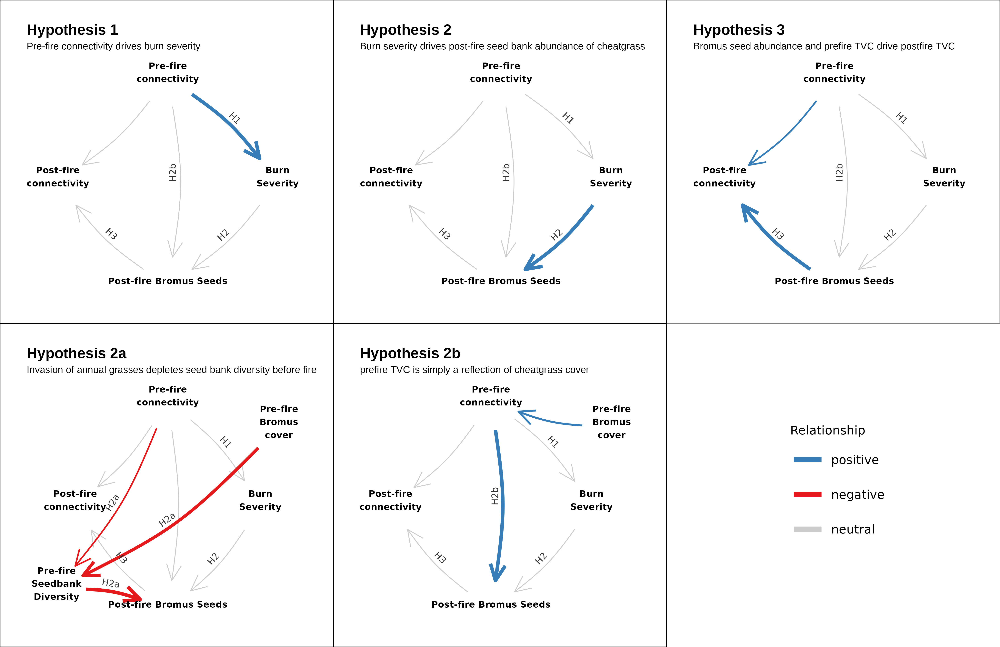

---
header-includes:
    - \usepackage{setspace}\doublespacing
    - \usepackage[left]{lineno}
bibliography: sb_refs.bib
mainfont: Times New Roman
fontsize: 12pt
geometry: margin=1in
output:
  
  pdf_document: 
    keep_tex: yes
  html_document:
    df_print: paged
  word_document: default
link-citations: yes
linkcolor: RoyalBlue
urlcolor: RoyalBlue
links-as-notes: false
---

```{r setup, include=FALSE}
knitr::opts_chunk$set(echo = FALSE,cache = FALSE)
```


\pagenumbering{arabic} 

Running head: Burn severity and ecosystem transformation

Title: Fuel connectivity, burn severity, and seedbank survivorship drive ecosystem transformation in a semi-arid shrubland.

Adam L. Mahood^1,2,3,`*`^, Michael J. Koontz^2^, Jennifer K. Balch^1,2,4^

\small

^1^ Department of Geography, University of Colorado Boulder, Boulder, CO, USA

^2^ Earth Lab, University of Colorado, Boulder, CO, USA

^3^ Water Resources, Agricultural Research Service, United States Department of Agriculture, Fort Collins, CO, USA

^4^ Environmental Data Science Innovation and Inclusion Lab, University of Colorado, Boulder, CO

`*` Corresponding author: admahood@gmail.com

\normalsize

Open Research Statement: All data and code used in the analysis are freely available at https://doi.org/10.5281/zenodo.5293996. The Bureau of Land Management’s Assessment, Inventory and Monitoring TerrADat dataset is available at version is available at: https://blm-gbp-hub-blm-egis.hub.arcgis.com/

\newpage

\linenumbers

## Abstract 

A key challenge in ecology is understanding how multiple drivers interact to precipitate persistent vegetation state changes. These state changes may be both precipitated and maintained by disturbances, but predicting whether the state change is fleeting or persistent requires an understanding of the mechanisms by which disturbance affects the alternative communities. In the sagebrush shrublands of the western United States, widespread annual grass invasion has increased fuel connectivity, which increases the size and spatial contiguity of fires, leading to post-fire monocultures of introduced annual grasses (IAG). The novel grassland state can be persistent, and more likely to promote large fires than the shrubland it replaced. But the mechanisms by which pre-fire invasion and fire occurrence are linked to higher post-fire flammability are not fully understood. A natural experiment to explore these interactions presented itself when we arrived in northern Nevada immediately after a 50,000 ha wildfire was extinguished.

We hypothesized that the novel grassland state is maintained via a reinforcing feedback where higher fuel connectivity increases burn severity, which subsequently increases post-fire IAG dispersal, seed survivorship, and fuel connectivity. We used a Bayesian joint species distribution model and structural equation model framework to assess the strength of the support for each element in this feedback pathway. We found that pre-fire fuel connectivity increased burn severity and that higher burn severity had mostly positive effects on the occurrence of IAG and another non-native species, and mostly negative or neutral relationships with all other species. Finally, we found that the abundance of IAG seeds in the seedbank immediately post-fire had a positive effect on the fuel connectivity 3 years after fire, completing a positive feedback promoting IAG. These results demonstrate that the strength of the positive feedback is controlled by measurable characteristics of ecosystem structure, composition and disturbance. Further, each node in the loop is affected independently by multiple global change drivers. It is possible that these characteristics can be modeled to predict threshold behavior and inform management actions to mitigate or slow the establishment of the grass-fire cycle, perhaps via targeted restoration applications or pre-fire fuel treatments.

*Keywords*: *Artemisia tridentata*, alternative stable states, *Bromus tectorum*, burn severity, cheatgrass, fuel connectivity, grass-fire cycle, joint species distribution model, resilience, sagebrush

## 1. Introduction

Ecosystems around the world are being affected simultaneously by multiple facets of global change. For example, changes in land use can facilitate exotic plant invasions [@Allan2015], which can alter ecosystem structure [@Davies2013]. Altered structure can change the likelihood of a disturbance, the properties of a disturbance and the capacity of the system to recover after a disturbance [@Brooks2004]. Global climate change can also directly affect the magnitude of disturbances [@Parks2020], and act as a demographic filter that influences how ecosystems recover after disturbances [@Rother2015; @Davis2019] via impacts on adult plant survival and seed dispersal [@Davis2018; @Eskelinen2020]. The combined effects of global change forces on structure, function and disturbance can cascade and interact. For example, while burn severity (or the proportion of biomass burned [@Keeley2009]) is influenced by vegetation structure [@Koontz2020; @Parks2018], it also increases with temperature and aridity [@Parks2020]. These forces can ultimately lead to permanent compositional change, biodiversity losses and the loss of ecosystem services [@Ratajczak2018; @Mahood2019; @Mahood2021] due to internal, self-reinforcing mechanisms that arise from those structural and functional changes which then maintain an alternative stable state [@Scheffer2003; @Ratajczak2018]. 

There is a long history of univariate time series observations that show sudden state changes [@Scheffer2003], and these have informed the development of theories that help us understand how systems of any type can change state suddenly, and exist in persistent alternative stable states [@Scheffer2015;  @Ratajczak2018]. These theories typically represent the system's state with a single variable, of which the mean is observed to abruptly change in time or space [@Scheffer2015]. Descriptive evidence of alternative stable states has been documented at broad scales in tropical ecosystems, where forests, savannas and grasslands are considered alternative stable states because they are floristically distinct [@Aleman2020] and cluster around static values of woody cover (80, 30 and 0 percent) while occurring along overlapping ranges of precipitation [@Hirota2011; @Staver2011]. The forested state has a self-reinforcing, positive feedback between evapotranspiration and tree cover [@Staal2020], while the grassland and savanna states are maintained by feedbacks between grass flammability and fire occurrence [@DAntonio1992; @Staver2011]. Alternative stable states are believed to be widespread [@Scheffer2001], but their existence is rarely proven at broader scales, with most demonstrative studies having been conducted in greenhouse and laboratory microcosm experiments [@Schroder2005]. One of the reasons for this is that ecological systems are much more complex than a simple bivariate system with a single driver and a single response. There may be multiple drivers, and the state is the product of interactions between organisms and their immediate environment, as well as countless inter- and intra-specific interactions.


A central challenge in ecology in the 21st century is to move from describing how plant communities are affected by global change to the capacity to predict how species pools will assemble and persist in response to global change [@Davis2018; @Keddy2021]. Prediction of community response to multi-faceted global change drivers is enhanced with a better understanding of the mechanisms that underlie community stability in the face of disturbances. A classic example of an ecosystem that appears to have disturbance-mediated alternative stable states (but see @Morris2016), but whose stability mechanisms aren't well understood is the invasion of *Bromus tectorum* L. and other introduced annual grasses in the Great Basin of the western United States. Here, it is well documented how the interaction of annual grass invasion, fire [@Balch2013] and grazing [@Williamson2019] are associated with the degradation or loss of over half of Wyoming big sagebrush (*Artemisia tridentata* ssp. *wyomingensis* Beetle & Young) ecosystems [@Davies2011]. These systems had a precolonial fire regime of infrequent, patchy fires [@Bukowski2013]. In uninvaded areas, the space between shrubs is typically composed of bare ground covered in biological soil crust and caespitose perennial plants (Figure 1). Because fire does not spread readily below a threshold of approximately 60% cover of flammable vegetation [@Archibald2012], the low fuel connectivity in these areas limits fire spread. Annual grass invasion increases fuel connectivity while decreasing fuel moisture [@Brooks2004; @Davies2013], leading to increased fire size and frequency [@Balch2013]. Sagebrush stands with high native perennial cover might need only a small amount of additional annual grass cover to alter ecosystem structure enough to alter the fire regime (Figure 2). After fire, the landscape is typically dominated by introduced annual grasses. But in order to understand how fire drives the persistence of the grassland state, we need to understand the demographic mechanisms by which fire impacts propagule dispersal and benefits the alternative state [@Davis2018]. As with forested systems, propagule dispersal is a key filter through which species must pass in order to establish and persist in a post-fire landscape [@Gill2022].

@Petraitis1999 posited that the maintenance of alternate species assemblages requires first a disturbance that removes the species from the initial assemblage and second the arrival of the species of the alternate assemblage. One understudied mechanism that may explain both for the *Artemisia*/*Bromus* system is the interaction between the species composition of the soil seed bank and burn severity. Because the invading species are annual, and many of the key native plant species are seed obligates, the seed is the key life history stage that fire must act upon to benefit the invading plants. Seeds and seedlings are particularly vulnerable to climate, competition and disturbance [@Enright2015]. Warmer and drier conditions simultaneously reduce recruitment, growth, and survival of seeds and seedlings [@Enright2015; @Schlaepfer2014], while also increasing burn severity [@Parks2020]. In fire prone ecosystems, seed obligate species typically have life history strategies to cope with fires that burn at different severities [@Maia2012; @Wright2016; @Palmer2018]. Soil heating from fire affects the response of vegetation to fire [@Gagnon2015], including the capacity of seeds to remain viable after fire [@Humphrey2001]. High severity fire can affect species that use the seedbank positively [@Kimura2011], negatively [@Heydari2017], or have no effect [@Lipoma2018], depending on species-specific adaptations. Both the depth of the burn and fire temperature can affect subsequent recovery by seed germination [@Morgan1988; @Schimmel1996], as well as seed mortality and physical seed dormancy mechanisms [@Liyanage2017]. 


In addition to size and frequency, exotic plant invasions can alter fire temperature [@Brooks2004; @Jones2015] and burn severity. While in many cases fires that burn at higher temperatures will also consume more biomass (i.e. burn at higher severity), grass fires may not always have such a relationship. Direct measurements have shown that *B. tectorum* burns at low temperatures [@Beckstead2011; @Germino2016], but because it also increases horizontal fuel connectivity [@Davies2013], it leads to more contiguously burned areas and therefore higher burn severity, despite lower fire temperatures. To benefit from fire, *B. tectorum* would need to gain a fitness benefit relative to other species

One way to achieve this is to disperse more viable seeds into the post-fire landscape than the other species and become well-represented in the post-fire plant assemblage [@Bond1995]. If the fire is patchy, this can happen through post-fire seed dispersal [@Monty2013]. Without unburned patches, seeds must survive the fire. If the increase in fuel connectivity caused by *B. tectorum* increases the severity of fire, one way burn severity might then influence the community composition of the post-fire seed bank to facilitate the post-fire dominance of *B. tectorum* would be to burn a contiguous area at a temperature high enough to kill fire-intolerant native seeds, but low enough that *B. tectorum* seeds survive and germinate more readily from fire-induced germination cues [@Naghipour2016; @Fenesi2016]. In other words, an area with high burn severity should have a lower relative occurrence of viable seeds of native species, and a higher relative occurrence of the seeds of fire-tolerant introduced annual plants. This would allow for the for the often-observed dominance of introduced annual grasses after a few years and would result in higher fuel connectivity, closing the positive feedback loop. Plants that are not adapted to frequent fire would be less likely to produce seeds that are adapted to surviving fire, or dispersal mechanisms to take advantage of the resources available immediately after fire [@Keeley2011]. To our knowledge, despite several studies on the relationship between fire occurrence and the seed bank in this system [@Hassan1986; @Humphrey2001; @Boudell2002], no studies to date have examined the effect of burn severity on the seed bank. Burn severity is more ecologically meaningful than fire occurrence, and is more useful for understanding threshold effects and stable states than a binary variable.


Here, we collected soil cores from 14 locations along the perimeter of a large fire (the Hot Pot fire, ~50,000 ha) immediately after it was extinguished, in northern Nevada in July 2016. Each location had paired burned and unburned samples. Because it burned a large area in only three days, we could sample a broad area while being reasonably certain that the weather conditions during the fire were similar at all sites. Because we collected our samples immediately after the fire was extinguished, we felt confident that the seed bank samples did not contain seeds deposited by post-fire dispersal. We put the samples in cold storage and germinated the seeds from those cores in a greenhouse the following spring. In spring 2017 and fall 2019 we collected information on vegetation structure and diversity at each location. We tested three hypotheses in this study that are depicted in Figure 3: (H1) Pre-fire fuel connectivity would be positively related to burn severity; (H2) burn severity would increase the occurrence probability of introduced annual species in the seed bank and reduce the occurrence probability of native species; and (H3) the abundance of post-fire *B. tectorum* seeds in the seedbank would be positively related to post-fire fuel connectivity. We examined two alternatives to H2: (H2a), increased fuel connectivity brought on by the invasion of annual grasses may have already depleted the diversity of the soil seed bank before the fire occurred; and (H2b) prefire fuel connectivity is solely reflective of annual grass cover, which drives post-fire annual grass seed abundance. In addition, because in our study system post-fire sites are floristically distinct from the pre-fire state [@Mahood2019], typically with near monocultures of *B. tectorum*, we hypothesized that (H4) high post-fire fuel connectivity of those near-monocultures would result in lower aboveground species diversity due to competitive exclusion of native plants.

## 2. Methods


*2.1 Study Area*

The study was conducted in north-central Nevada the day after a large fire (the Hot Pot Fire) was extinguished (Appendix S1: Fig. S1). The Hot Pot Fire burned just over 50,000 hectares in less than a week. The pre-fire landcover was predominantly *B. tectorum* and Wyoming big sagebrush plant communities. The fire occurred after the early season plants, including *B. tectorum* and *Poa secunda* J. Presl, the most abundant native understory species, had gone to seed, and before the late season species, including Wyoming big sagebrush, had produced flowers. Thus we were able to isolate the effect of the fire without any confounding effects of post-fire seed dispersal, while achieving a broad spatial extent. The sites we sampled ranged from 1,397 to 1,607 meters in elevation. 

*2.2 Seed Bank Sampling* 

In early July 2016, we collected samples of the soil seed bank at fourteen locations the day after the Hot Pot fire was contained. Each site was located at the perimeter of the fire where it was clearly delineated by a bulldozer line or in one case a narrow dirt road. We were confident paired sites were of the same pre-fire composition because we had been working in these areas all summer collecting data for another study. Eleven sites were mature sagebrush communities with no history of fire since at least 1984. Three sites had previously burned in 1984 according to the Monitoring Trends in Burn Severity (MTBS) fire history [@Eidenshink2007] and had high cover of *B. tectorum*, but still had scattered sagebrush cover. We used a metal stake to mark paired burned and unburned sampling locations on each side of the perimeter, 10 m from the nearest evidence of anthropogenic disturbance (i.e. bulldozer effects, footprints) associated with active fire suppression along the perimeter. Within 3 m of each marker, we extracted twelve, 6 cm deep, 5 cm diameter, soil cores. Seeds of sagebrush generally do not fall far (<30 m) from their parent plants in this system [@Shinneman2016], and so they are not uniformly distributed [@Boudell2002]. In addition, seeds from *B. tectorum* and *Artemisia* have different germination rates based on the micro-site they find themselves in [i.e. under a shrub or in the bare ground between shrubs, @Eckert1986]. To account for these potentially confounding effects, we placed half of the core locations under shrubs, half in shrub interspaces, and aggregated the cores for each site. In the burned areas, it was obvious where shrubs had been located. Even when they were completely incinerated, their imprint remained on the soil surface [@Bechtold2007]. To examine the effect of seed depth, we divided each soil core into 0-2 cm and 2-6 cm depths. Litter was aggregated with the 0-2 cm samples. Samples were then placed in cold storage (~2 deg C) for 3 months [@Meyer2013]. At all sites, to be sure that we were at a site where sagebrush germination could occur we checked for first year germinants on the unburned side (we found them at all sites), and to ensure that there were no confounding effects of post-fire seed dispersal, we determined whether or not the sagebrush were flowering (they were not flowering at all sites), and recorded species occupancy for all aboveground plant species. 

We followed the methodology of Ter Heert et al. [-@Heerdt1996] to germinate the seeds. Each sample was run through 0.2 mm sieve, and spread in a 3-5 mm layer over the top of 1 - 4 pots. These pots were filled 3 cm deep with potting soil, topped by a thin layer of sand. Pots were watered as needed to stay at field capacity. Every week emerging germinants were identified, counted and removed. Most of the germination occurred within 6 weeks, and after 8 weeks we ended the germination assay.  


*2.3 Post-Fire Vegetation Sampling*

We sampled the aboveground fuel structure and plant diversity in May 2017, the growing season immediately after the fire and again in September 2019. At each location, we established 50m transects starting at the boundary of the burned and unburned sides of the perimeter, running perpendicular to the fire perimeter, and marked the transect ends with rebar. In order to characterize aboveground plant diversity, we measured the occupancy and abundance of all plant species by measuring cover of every species in 0.1 m$^2$ quadrats spaced every 5 m along each transect. We measured shrub cover (coarse fuels) and herbaceous plant cover (fine fuels) using the line intercept method along the transect, a commonly-used approach for characterizing fuel structure [@Elzinga1998]. We calculated total vegetation cover (TVC) as the sum of the fine and coarse fuel measurements. Both live and dead plants were included in these measurements. 

*2.4 Remotely-Sensed Burn Severity*

We downloaded the "fire bundle" of the Hot Pot fire from www.mtbs.gov. This included cloud-free Landsat 8 scenes collected before the Hot Pot fire, and already calculated layers of the Differenced Normalized Burn Ratio [dNBR, Equations 1 & 2, @Miller2009]. Because our sites were generally within 10 meters of the burn perimeter, The pixels directly intersecting the site locations were likely to be mixed pixels (i.e. containing burned and unburned ground). To minimize this effect, we extracted all the dNBR values within a 120 meter buffer of each seed bank site for pixels whose centroids fell inside of the fire perimeter and calculated the mean. 

**Equation 1:** $NBR = (NIR-SWIR_1)/(NIR+SWIR_1)$

**Equation 2:** $dNBR = (NRB_{prefire} - NBR_{postfire})*1000$

*2.5 Statistical Analysis*

Our statistical analysis centered around trying to understand each component of the positive feedback loop posited by the 4 hypotheses described above. In order to understand how pre-fire fuel connectivity influenced burn severity (H1), we used total vegetation cover (TVC) from two separate data sources as a proxy for fuel connectivity, and created separate linear models with TVC as the predictor variable and burn severity [dNBR, @Miller2009] as the response variable. With the field data we collected, we created an ordinary least squares (OLS) linear model with burn severity as the dependent variable and TVC (defined as shrub cover plus herbaceous plant cover from the unburned side of the paired sites), elevation and aspect as independent variables. 

We were concerned that because our data were collected at the edge of the fire, the burn severity calculated at each point may have included partially burned pixels. So, as a supplement, we examined the same relationship by creating a model of TVC using Landsat Thematic Mapper (TM) surface reflectance data using field measurements of TVC from the Bureau of Land Management's Assessment, Inventory and Monitoring dataset [AIM, @AIM]. The AIM dataset contained 813 sampling locations within the Central Basin and Range ecoregion [@CEC2006] that were visited by BLM field crews between 2011 and 2015. They were mostly sampled once but there were some repeats, for 1,117 total measurements. For each of these points, we extracted the surface reflectance values of each Landsat band for the sampling year near peak biomass using a cloud-free scene from May or early June. Then, we used those surface reflectance values to calculate various vegetation indexes (Appendix S1: Table S1), including the Green Normalized Difference Vegetation Index (Green NDVI, Equation 3), and Normalized Difference Senesced Vegetation Index (NDSVI, Equation 4). We used these two indexes and their interactions as predictors in a generalized linear model of TVC with a beta distribution. We used the model to create a layer of estimated pre-fire TVC for the study area, and extracted both our predictions of TVC and dNBR of the fire from 1000 regularly-spaced points within the fire perimeter. Finally, to quantify the effect of TVC on burn severity, we created an OLS linear model with our modeled TVC and its second-order polynomial as predictor variables and burn severity as the response variable.

**Equation 3:** $Green~NDVI = \frac{NIR - Green}{NIR + Green}$

**Equation 4:** $NDSVI = \frac{SWIR_1 - Red}{SWIR_1 + Red}$

To examine how burn severity affected the community composition of the seed bank (H2), we created a joint species distribution model (JSDM) in a Bayesian framework [@HMSC] for the occurrence of all species germinated from the seed bank that were found at more than one location. We created four Markov Chain Monte Carlo (MCMC) chains, each consisting of 150,000 iterations. We discarded the first 50,000 iterations for each chain and then recorded every 100th for a total of 1,000 posterior samples per chain, and 4,000 total. We assessed model convergence using the effective sample size and the potential scale reduction factor [@Gelman1992]. We used the model to predict the probability of occurrence of germinable seeds of a given species along a gradient of burn severity. We included burn severity, elevation, aspect, pre-fire seedbank diversity and soil depth as independent variables. 

To account for the possibility that increased fuel connectivity brought on by the invasion of annual grasses may have already depleted the diversity of the soil seed bank before the fire occurred (H2a) as a confounding factor, we included the Shannon-Weaver diversity index [@Shannon1949] in the paired, unburned seed bank samples as one of the predictor variables in our JSDM. We also created OLS models with the unburned species richness and Shannon-Weaver diversity index predicted by prefire fuel connectivity, with the expectation that pre-fire fuel connectivity would have had a negative effect on the prefire seedbank diversity. To examine how community composition and burn severity then affected subsequent fuel connectivity (H3), we created OLS models with fuel connectivity three years post-fire as the dependent variable, and burn severity, seed counts for *B. tectorum*, *P. secunda* and other species, elevation, aspect, depth, and alpha diversity as independent variables. To examine how the resulting fuel connectivity was related to biodiversity (H4), we used the aboveground diversity data and connectivity data that we collected in 2019 to create a Poisson GLM with number of species encountered at each site as the dependent variable, as well as an OLS linear model with the Shannon-Weaver index for the plant species as a dependent variable. We used fuel connectivity, elevation, and aspect as independent variables.

In order to examine hypotheses 1-3 in a single framework we constructed a path model [@Rosseel2012].  We had paths leading from pre-fire connectivity, through burn severity to the log of the post-fire count of B. tectorum seeds in the seedbank, and finally to post-fire connectivity. Pre-fire cover of B. tectorum, elevation, pre-fire seed bank diversity and pre-fire aboveground diversity were also accounted for. 

All analyses were done in R [@R]. Data and code to recreate the analysis are freely available at https://doi.org/10.5281/zenodo.5293996.

## 3. Results
 
We found support for each hypothesized component of the positive feedback loop independently and when combined in the path model ($\chi^2$ = 3.17, p = 0.39, Figure 4a, Appendix S1: Tables S4 & S5). For H1, TVC had a weak positive relationship with burn severity ($\beta$ = 2.4, p = 0.083, R$^2$ = 0.27, Figure 4b, Appendix S1: Table S2). For our remotely sensed analysis, Green NDVI, NDSVI and their interaction explained 35% of the variation in pre-fire TVC (Appendix S1: Table S2). This predicted TVC had a positive relationship with burn severity (p << 0.01, R$^2$ = .42, Figure 4b, Appendix S1: Table S2). 


The majority of seeds that germinated in the greenhouse were the two most common grass species, *P secunda* and *B. tectorum* (Appendix S1: Table S3, Fig. S2). Eight dicot species were found in more than one location, and these 10 prevalent species are those that were used in our JSDM. Burned sites had an average of 34 $\pm$ 32 total seeds in the top 2 cm, and 12 $\pm$ 14 in the bottom 4 cm. Unburned sites had an average of 299 $\pm$ 170 in the top 2 cm and 59 $\pm$ 29 in the bottom 4 cm (Appendix S1: Fig. S3). For H2, the JSDM converged well (Appendix S1: Fig S4). Gelman diagnostics were all very close to 1 and the effective sample size centered on 4,000, which indicated good model convergence. Elevation had the strongest effects on individual species occurrence and explained the most variance on average (36%). Burn severity explained 23% of the variance on average and was supported at the 95% level for 5 species (Appendix S1: Fig S2b). For the introduced species, the predictions along a gradient of burn severity were positive for *B. tectorum*, *Sisymbrium altissimum* L. and *Lepidium perfoliatum* L., and negative for *Ceratocephala testiculata* and *Alyssum desertorum* Stapf (Figure 4e). For native species, the effect of burn severity on occurrence was positive for *A. tridentata*, but the mean predictions were still low, never rising above 50%. It was neutral for *P. secunda* and negative for the remaining species. Testing H2a revealed a positive relationship between pre-fire aboveground species diversity and pre-fire fuel connectivity in the single model, and neutral relationships in the path model, and so we felt it was reasonable to rule out pre-fire fuel connectivity as a confounding factor for H2. Testing H2b showed a negative relationship, allowing us to rule out the idea that both pre-fire connectivity and post-fire seed bank composition were simply a function of pre-fire annual grass cover.

For H3, we found that, after accounting for elevation, pre-fire aboveground richness, and the number of *P. secunda* seeds, the number of *B. tectorum* seeds in the post-fire seedbank was positively associated with the fuel connectivity in 2019 ($\beta$ = 0.54, p = 0.01, Adj R$^2$ = 0.75,Figure 4c, Appendix S1: Table S2). For H4 the most parsimonious model (Adj R$^2$ = 0.89, Appendix S1: Table S2) had elevation, aspect, fuel connectivity and an interaction between elevation and fuel connectivity as predictors of aboveground Shannon-Weaver alpha diversity. Fuel connectivity was negatively associated with Shannon-Weaver diversity ($\beta$ = -0.28, p=0.004, Figure 4d).


## 4. Discussion

Here we document how changes in ecosystem structure brought on by invasion can lead to cascading effects on ecosystem function and composition via changes in the disturbance regime. It has already been shown that *B. tectorum* invasion increases fire frequency [@Balch2013], and is indicative of a grass-fire cycle. However, an understanding of the positive feedback mechanisms that link *B. tectorum* invasion success to fire occurrence is required to infer the long-term persistence of such a cycle. The interaction between burn severity and seed bank composition documented here may explain that link. Prior work has shown that annual grass invasion increases fuel connectivity by filling in shrub interspaces with a contiguous bed of fine fuels [@Davies2013]. This change in the spatial distribution of fine fuels has been associated with larger and more frequent fires [@Balch2013]. Here, we found higher fuel connectivity (via TVC) increased burn severity (H1, Figure 4b). Higher burn severity was associated with an increased occurrence of introduced annuals in the post-fire seedbank and a decreased occurrence of native plants with the exception of *A. tridentata* (H2, Figure 4e), but the gains of *A. tridentata* would likely not be enough to counter the gains of *B. tectorum*, especially after a few years of annual grass reproduction and population growth without similar gains for the shrubs [@Shriver2019]. Finally, greater abundance of *B. tectorum* seeds in the post-fire seedbank resulted in higher post-fire fuel connectivity (H3, Figure 4c). In addition, we found evidence that high post-fire fuel connectivity was associated with lower aboveground diversity (H4, Figure 4d). This suggests that during inter-fire intervals, there may be additional mechanisms (e.g. competition, altered ecohydrology) maintaining the post-fire, annual grass-dominated species assemblage.

The difference in species composition before and after fire explains an apparent contradiction in results between H2a (positive to neutral relationship between pre-fire fuel connectivity and diversity) and H4 (negative relationship between post-fire fuel connectivity and diversity). Most site locations had mature canopies of native shrubs with the inter-shrub space occupied mostly by native bunchgrasses and forbs, with no fire occurrence since 1984. Even in locations with high annual grass cover between shrubs, shrubs provide ecosystem structural heterogeneity and islands of fertility [@Doescher1984; @Bechtold2007], and perennial natives that may have been established before invasion have deep roots established that allow for the avoidance of competition for water with shallow-rooted annuals [@Gibbens2001; @Ottaviani2020]. This may provide enough niche compartmentalization to allow native plants to persist in spite of the invasion prior to fire occurrence. Three years after fire, almost all of the sites were dominated by introduced annuals, and lacked any structural heterogeneity (Appendix S1: Fig. S6c). Thus native plants may have been able to persist via niche compartmentalization after the initial invasion, but fire burned away most of the seeds (Appendix S1: Fig. S3, S7) and removed all of the structural benefits, and microclimatic refugia that shrub cover provides. In this clean slate post-fire environment, the altered species composition of the seedbank and superior post-fire dispersal of *B. tectorum* [@Monty2013] allow the process of interspecific competition to be dominant [@Schlaepfer2014].

***Contrasts among forests and shrublands as it pertains to remote sensing***

Burn severity metrics like dNBR were conceived of in the context of forested ecosystems, and calibrated using the composite burn index [@Key1999], tree mortality, and percent change in tree canopy cover [@Miller2009]. It is unclear how well these metrics carry over to shrubland systems. We recorded qualitative observations of burn severity while we were sampling, mainly to ensure that we sampled a range of severities, and the dNBR we used appears to correspond with our observations. In areas where the space between shrubs was well-connected by fine fuels (Figure 1 a-c) the burn severity was higher, and the shrubs had completely burned throughout the root system, leaving only a hole in the ground filled with ashes as evidence of their prior presence. In these areas the entirety of the soil surface---underneath shrub canopy and in canopy interspaces---was consumed by fire, and there was little evidence of remaining litter or biological soil crust. Areas with lower fuel connectivity had lower burn severity (Figure 1 d-f). Here, shrubs were usually consumed only to the stumps, and sometimes left standing and charred, destined for mortality. In these areas the soil surface often still had biological soil crust, partially consumed litter [@Jones2015] and unconsumed annual and perennial grass bases. The manual severity classification provided by MTBS had exclusively low and medium severity, but our observations of essentially complete consumption of plant and litter tissues and very few unburned patches suggested that these should have been mostly medium and high severity. This discrepancy was not unexpected, as the ordinal burn severity classifications produced by MTBS are known to be flawed for research use [@Kolden2015].

Spectral reflectance has long been used to characterize ecosystem structure, including wildfire fuels. Unique signatures of remotely-sensed spectral reflectance are typically matched to categorical fuel classifications (CFCs), which describe the physiognomy of vegetation and its potential to support various fire behavior [@Ottmar2007]. While different CFCs can provide a general understanding of fuel amount and connectivity, recent efforts using data with finer spatial and spectral resolution may improve fuel classification with more continuous, multi-dimensional measurements [@Stavros2018]. The continuous measure of NDVI in western U.S. coniferous forests is a proxy for live fuel biomass, which likely explains its positive association with wildfire severity [@Parks2018; @Koontz2020]. NDVI also correlates with vegetation cover in these forested systems, and so greater crown connectivity may also explain the NDVI/severity relationship at local scales. When using a more direct NDVI-derived measure of vegetation connectivity in Sierra Nevada yellow pine/mixed-conifer, @Koontz2020 found that greater variability in forest structure, decreased the probability of high-severity fire, likely due to decreased fuel connectivity (i.e., live tree canopies in the yellow pine/mixed-conifer forest). Here, we arrived at a combination of NDVI and NDSVI to describe the fuel connectivity of the annual grass invaded Great Basin sagebrush community to better reflect key differences in the physiognomies of forest and arid shrublands. In sagebrush shrublands, the fuel that contributes to large wildfires is a mixture of evergreen shrubs interspersed with herbaceous plants that remain green for only a portion of the growing season, and then become dry and straw-colored. Thus, both the live and dead fuel need to be taken into account in remote measurements of fuel connectivity for this system.

***Management implications***

These results demonstrate that the strength of the grass-fire cycle in this system is controlled by measurable fire properties and ecosystem structural components. We found that annual grass cover was not the single variable that explained burn severity and fuel connectivity (Appendix S1: Fig S5). Rather, it was the contribution of annual grass cover to the total connectivity of the system (Figure 2). The most important areas to prioritize for management interventions could paradoxically be areas with relatively low levels of annual grass cover that join previously disconnected vegetation. Land managers may be able to increase their chances of restoration success by using existing methods or developing novel ones that manipulate these components to weaken or even break the positive feedback cycle. This work provides further evidence that the post-fire annual grassland is a system where the degraded state represents an alternative species assemblage from that of the restoration target. Because the propagules of the original assemblage are no longer present, methods that rely on natural succession may not be sufficient [@Suding2004]. One-off seeding treatments have a low probability of success [@Pyke2020; @Arkle2022], and more labor-intensive methods involving site preparation [@Farrell2021], seed coating and priming [@Pedrini2020], as well as planting live plants [@Pyke2020] may improve the probability of success, as will prioritizing efforts in cooler, wetter years [@Bradford2018; @Hardegree2018; @Shriver2018]. Estimating burn severity using satellite imagery may be used in conjunction with site suitability and climate forecasts to help land managers identify areas with a greater likelihood of successful seeding. Our results highlight the importance of prioritizing the preservation of existing native shrub cover and in particular policies that encourage land managers to maximize the preservation of unburned patches within the fire perimeter during the suppression of wildfires in this system [@Steenvoorden2019], as these are the primary sources of native propagules and act as nurse plants [@Arkle2022]. In many areas, conditions are now or will in the near future be unsuitable for sagebrush due to annual grass dominance and increases in aridity [@Shriver2019]. In these areas it may still be feasible to restore the system’s ability to sequester carbon by planting other native woody species that are more drought tolerant and resilient against fire.


Livestock grazing can reduce fuel connectivity in uninvaded sagebrush [@Davies2010]. At the same time, livestock grazing can decrease the resistance to invasion by *B. tectorum* via negative effects on biological soil crust (BSC) [@Condon2018], and can reduce the survival of *Artemisia* seedlings that are not protected by shrub canopies [@Owens1992]. Targeted spring grazing in annual grass monocultures may reduce fuel connectivity and alleviate fire risk. Post-fire grazing may help reduce *B. tectorum* cover, but it may also exacerbate the problem by introducing *B. tectorum* in uninvaded sites [@Williamson2019] or increasing the already superior post-fire dispersal of *B. tectorum* seeds [@Monty2013]. Management interventions should be specifically tailored each year to the conditions of a given site, and focused on native plant restoration.

Herbaceous cover in these dryland systems has high interannual variability [@Mahood2021]. Because the components of ecosystem structure and disturbance severity in positive feedback cycle described here are continuous mechanistic variables, it may be possible to develop theoretical models (*sensu* [@Archibald2012]) to estimate the threshold of vegetation cover that will lead to high burn severity. These can then be applied in conjunction with near real time fuel loading forecasts [@Jones2021] to identify areas that are vulnerable to high severity fire, which can be used by land managers to take preemptive measures in high value areas. 


***Global environmental change implications***

Understanding how different facets of global environmental change create multiple mechanisms that act in concert to drive ecosystem transformation will provide important insights about ecosystem change from regional to global scales. The system studied here has at least four external processes that may influence the positive feedback we documented. First, land use change via livestock grazing facilitates invasion [@Ponzetti2007; @Williamson2019]. Second, the introduction of exotic grasses increases fuel connectivity [@Davies2013], affects burn severity. Third, increasing temperatures due to climate change increase burn severity in forests [@Parks2020]. We expect this to be true for shrublands, and is an important area for future research. Increasing temperatures simultaneously decrease seed viability and seedling survival [@Schlaepfer2014; @Enright2015]. Fourth, CO$_2$ enrichment may preferentially enhance biomass (i.e. higher fuel connectivity) and seed production of annual grass species [@Smith2000; @Nagel2004]. All four of these external drivers are globally ubiquitous consequences of global change.

An ecosystem "state" is the product of countless endogenous interactions. The grass-fire cycle studied here is strengthened through providing fitness benefits to the introduced annual grasses via at least three reinforcing processes. First, we document how it changes the composition of the seedbank. Second, introduced annual grasses competitively exclude native plants. Third, the dominance of introduced annual grasses initiates ecohydrological feedbacks to create a warmer, drier microclimate [@Turnbull2012]. It is possible that some of these feedbacks are idiosyncratic to the system being studied, while others may reflect fundamental properties of ecosystem function that change when a system is converted from being dominated by deep-rooted woody plants to being dominated by annual herbaceous plants [@Kitzberger2016]. At least 13 grass species initiate self-reinforcing feedbacks with fire in the U.S. alone [@Fusco2019; @Tortorelli2020]. There are many more fire-inducing grass invasions worldwide, with documented cases in Australia [@Miller2010], Brazil [@Rossi2014] and South Africa [@Milton2004]. The conversion of forests and shrublands to grasslands may have consequences relevant to the global carbon cycle, especially when ecosystems dominated by deep-rooted plants that store carbon belowground are replaced by shallow-rooted ecosystems that lose carbon to grazing and fire [@Kerns2020; @Mahood2021]. 

## Acknowledgements

We thank Abdelhakim Farid, Julia Lopez, Dylan Murphy and C. Nick Whittemore (Figure 1) for help in the field and in the greenhouse, and Lindsay P. Chiquoine, Thomas T. Veblen and two anonymous reviewers for constructive feedback that greatly improved the manuscript. We are grateful to everyone in the Winnemucca office of the Bureau of Land Management, the Central Nevada Interagency Dispatch Center, and CU Boulder's Ecology Evolution and Biology Greenhouse. This project was funded in part by the CU Boulder Undergraduate Research Opportunities Program and the Geography department's Adam Kolff Memorial Graduate Research Grant.

## References

<div id ="refs"></div>

\newpage

## Figure Captions

**Figure 1.** Visual illustration of the relationship between fuel connectivity and burn severity. On the left, panel a shows the inter-shrub space invaded by annual grasses. The photo in panel b was taken in the exact same place two weeks later, days after all of the biomass was consumed by the fire. Panel C is a closeup of the soil surface, showing in more detail how the litter was also almost completely consumed by the fire. On the right, the photos in panels d and e were on opposite sides of a fire line in an area that had minimal annual grass invasion over a broad area, and thus lower fuel connectivity. Note the remaining plants and stumps in panel e and the presence of only partially consumed litter in panel f.


**Figure 2.** Sites with little to no shrub cover require high IAG cover to meet the threshold necessary to carry a fire, while sites with higher shrub cover may reach that threshold with much lower IAG cover. Therefore, annual grass cover alone may not be sufficient for quantifying fire risk. Panel a illustrates this point using publicly available data from the Bureau of Land Management's Assessment, Inventory and Monitoring dataset. Panels b and c show quadrats at a site with high, pre-fire native perennial cover weeks before and days after the Hot Pot fire, which burned at high severity at that site. 

**Figure 3.** Conceptual diagram of the hypotheses tested in this study.

**Figure 4.** Panel a is a path model showing support for the various hypotheses depicted in Figure 3. Red arrows are negative relationships, blue arrows are positive relationships, and grey arrows are not significant (p > 0.05) but still accounted for in the model. Abbreviations: pre = pre-fire; post = post-fire; cv = cover; elv = elevation; ag = aboveground; sb = seed bank; sev = severity; div = diversity. On the left side of (b), burn severity (dNBR) as predicted by total vegetation cover (TVC; the sum of live and dead, shrub and herbaceous cover). On the right, burn severity is predicted by modelled TVC. In (c), fuel connectivity three years post-fire is modelled by seedbank composition, elevation and pre-fire aboveground species richness. In (d) Shannon-Weaver diversity index of the aboveground, post-fire community composition, was negatively affected by fuel connectivity after accounting for elevation. For a, c and d, lines are the fitted partial effects, points are the partial residuals, and dotted lines are the 95% confidence intervals. p < 0.05 for black lines, p > 0.05 for grey lines. Panel e shows the modeled occurrence of germinable seeds for all species found at more than one location along a gradient of burn severity, after accounting for soil depth, aspect, elevation and pre-fire diversity. Black line is the mean prediction, each colored line represents one posterior sample.


<!-- \newpage -->

<!-- { width=75% } -->

<!-- \newpage -->

<!--  -->

<!-- \newpage -->

<!--  -->

<!-- \newpage -->

<!--  -->


