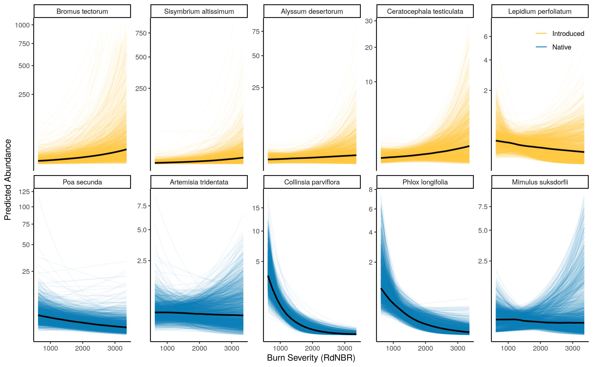

\beginsupplement

```{r, message=F, echo=F, warning=F, results='asis'}
library(knitr)
library(dplyr)
library(kableExtra)
options(knitr.kable.NA = '')
striped_index <- seq(3,33,2) # can delete once the bug is fixed
read.csv("/home/a/projects/seed_bank/data/counts_modified_byhand1.csv") %>%
  dplyr::select(-species) %>%
  kable(caption = "Seeds germinated in the greenhouse from the cores we collected.", format="latex",
      booktabs=T) %>%
  kable_styling(position="left",latex_options = c("hold_position", "scale_down"), stripe_index = seq(3,33,2)) %>%
  group_rows("B. tectorum",     2, 5, italic=T)%>%
  group_rows("P. secunda",      6, 9, italic=T)%>%
  group_rows("A. tridentata",   10,13, italic=T)%>%
  group_rows("A. desertorum",   14,17, italic=T) %>%
  group_rows("C. testiculatum", 18,21, italic=T) %>%
  group_rows("C. parviflora",   22,25, italic=T) %>%
  group_rows("S. altissimum",   26,29, italic=T) %>%
  group_rows("M. gracilis",     30,33, italic=T) %>%
  group_rows("Other species",   34,34, italic=F) %>%
  footnote(general = c("U = Unburned", "B = Burned", "T2 = Top 2 cm", "B4 = Bottom 4 cm"))

```

<!--  -->


